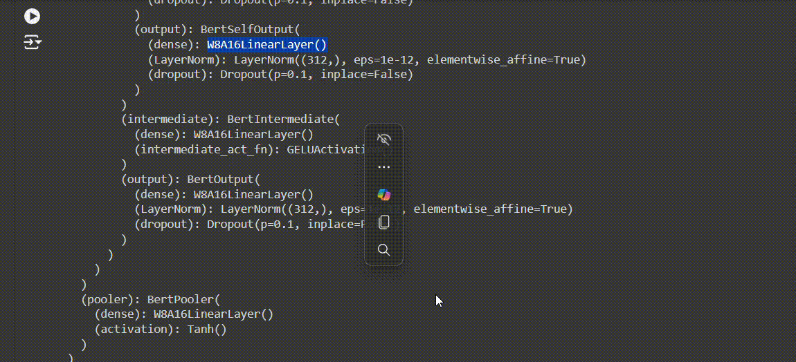

# Pruing and Quantization of Model
## Pruning
```python
def prune_weights(weights, pruning_percentage):
    """ Prune the weights based on the specified percentage. """
    # Calculate the threshold for pruning
    num_weights = weights.numel()
    threshold_index = int(num_weights * pruning_percentage)

    # Get the absolute values of weights and find the threshold
    abs_weights = weights.abs().view(-1)
    threshold = torch.kthvalue(abs_weights, threshold_index).values.item()

    # Create a mask for pruning
    mask = abs_weights >= threshold
    pruned_weights = weights * mask.view_as(weights)

    return pruned_weights
```

## Quantization

```python
def quantize(self, weights):
        # Upcast the weights to FP32 for stability
        w_fp32 = weights.clone().to(torch.float32)

        scales = w_fp32.abs().max(dim=-1).values / 127
        scales = scales.to(weights.dtype)

        int8_weights = torch.round(weights / scales.unsqueeze(1)).to(torch.int8)
        self.int8_weights = int8_weights
        self.scales = scales

```
### Quantized Layers



### Memory Footprint after Pruning and Quantization

| LoRA Tiny BERT (MB) | After Pruing and Quantizing (MB) | Percentage Reduction (%) |
|---|---|---|
| 54.74 | 41.49 | 24.21 |

## Evaluation of the model
| Metric | Value |
|---|---|
| Accuracy | 0.47868 |
| Precision | 0.4755200800782364 |
| Recall | 0.47868 |
| F1-score | 0.4612957278396014 |


# [Federated Learning ->](02_Stage-2.md)
## [<- Fine Tuning ](01-2_Stage-1.md)
