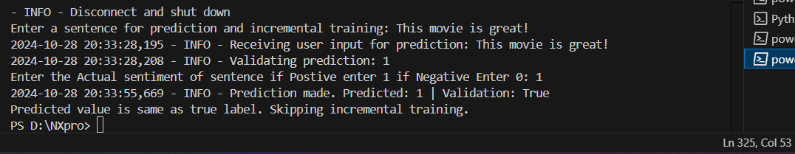

# Federated Learning
Federated Learning (FL) is a decentralized machine learning technique where multiple clients, such as mobile devices or edge servers, collaboratively train a shared model without sharing their raw data.

- Each client trains a local model on its own data, and then sends the model updates to a central server. The server aggregates these updates to improve the global model, which is then distributed back to the clients for further training.

## Starting Server

This is the initial stages of a Federated Learning (FL) experiment using the Flower framework. The server is starting up and preparing for the first round of training.

- The server is running in gRPC mode, which is a high-performance, open-source framework for communication between services.

- The server is using initial global parameters provided by the FL strategy. These parameters will be shared with the clients for the first round of training.

- The server is configuring the first round of training. It has selected 2 clients out of a total of 2 clients to participate in this round.

## Client Model Training 

- **Timestamp:** The time when the message was logged.
- **INFO:** This indicates the level of logging. It's a general informational message.
- **Epoch:** The current training epoch. An epoch is one complete pass through the entire training dataset.
- **Loss:** The loss value for the current epoch. This is a measure of how well the model is performing. Lower loss values generally indicate better performance.

- Shows that the model is being trained iteratively, and the loss is gradually decreasing, suggesting that the model is learning and improving.

## Incremental Learning

- Client 1:

- Client 2:

- A client-side interaction in a Federated Learning (FL) setup, specifically focusing on incremental learning and model validation.

1. **User Input:**
The user enters a sentence for prediction and potential incremental training: "This movie is great!"

2. **Model Prediction:**
The client's local model processes the input sentence and predicts its sentiment. In this case, the model predicts a sentiment of 1, indicating a positive sentiment.

3. **Validation:**
The user provides the actual sentiment label (1 for positive).
The predicted sentiment is compared to the actual sentiment.

4. **Incremental Learning:**
If the predicted sentiment differs from the actual sentiment, the model is updated using the incorrect prediction as a learning example. This is known as incremental learning, where the model learns from new data without retraining on the entire dataset.

## Summary 

-  The output summarizes the performance of the FL process. 
- The model has completed one round of training, achieving a certain level of loss and accuracy. 

# [Edge Deployment ->](03_Stage-3.md)
## [<- Pruning and Quantization ](01-3_Stage-1.md)